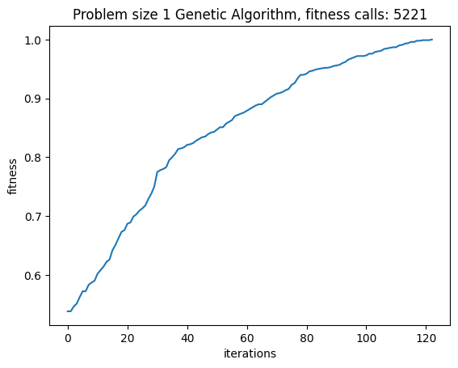
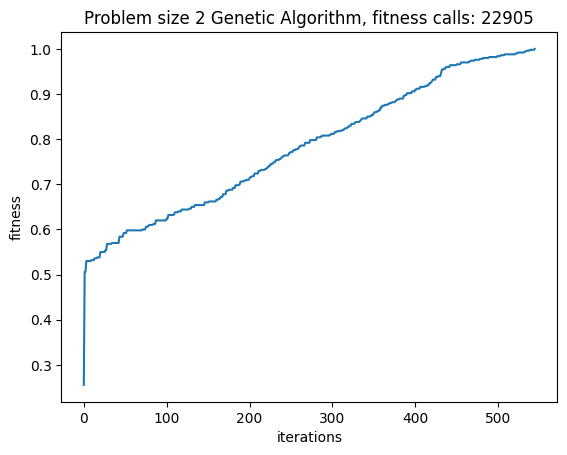
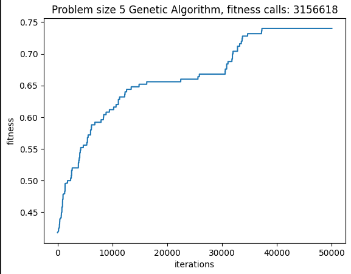
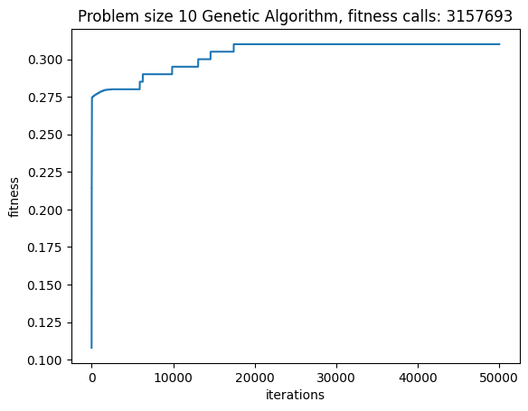
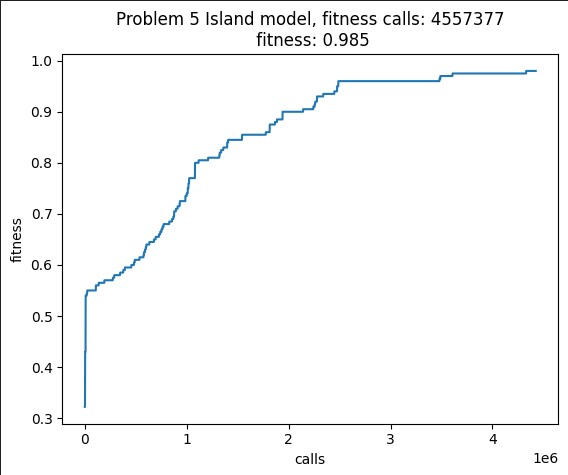
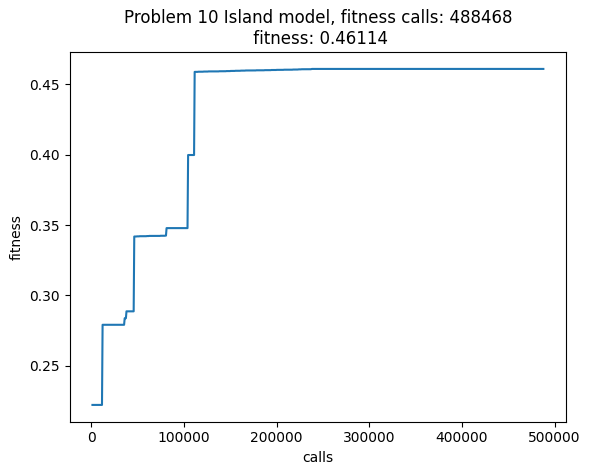
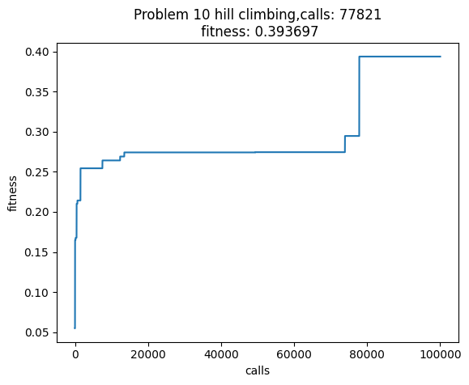

# LAB9
## Goal

The goal of this Laboratory is to solve,reaching a fitness value equal to 1.0, the four instances of the "Problem" with sizes 1,2,5 and 10, by approaching it as a black box.

## Collaborations
I worked with Arturo Adelfio (s316716).

## Adopted Strategies

Since the problem regards managing bit strings, we adopted a Genetic Algorithm (GA) to solve it. For the instances 1 and 2 we managed to solve it with not too many fitness calls, by making some generations in which we adopted the one_cut_xover, a MUTATION_PROBABILITY of 0.15, that we tuned according to the performances.

With problems of increasing complexity this approach generates poor resutls since it did not converge to 1. Here some graphics:

So, to promote diversity inside the population we implemented an Island Model with a certain probability of migration, and we created the islands by choosing similar individuals. We tried two methods to compute similarity, one using a Kmeans clustering approach to group individuals that have similar genotype, and one that sorts by the fitness.

In addition, we experimented a technique that selects the migrants among the best or randomly with a 0.5 probability and we noticed that this helped. 

We faced the premature convergence problem and did not reach 1, although we were close for the problem 5, but not at all for the instance at 10.

As further methods to promote diversity we tried to create the islands with different mutation rates and crossover types and by forcing the duplicates removal at each generation, to escape from premature convergence. But if at first this seemed to be a reasonable solution, then we noticed that it was not the best configuration, even though sometimes the removal of duplicates improves the solution.

The best parameters are:
ALL_POPULATION_SIZE = 300
TOURNAMENT_SIZE = 2
MUTATION_PROBABILITY = 0.01
MIGRATION_PROBABILITY=0.01
LOCI=1000
num_islands=5
POPULATION_SIZE=ALL_POPULATION_SIZE//num_islands
OFFSPRING_SIZE =POPULATION_SIZE//3
is_removing=False
num_migrants=10

Then we tried to verify what were the performances of an hill climbing algorithm, in his Steepest Ascent version, combined with some random mutation, since we read in article among the linked ones, about a study in which this algorithm performed better then GA, but unfortunately this was not our case.

## References

To better understand the problem and the algorithms we read the following papers:

- [Theoretical and Empirical Evaluation ofDiversity-preserving Mechanisms inEvolutionary Algorithms](https://core.ac.uk/reader/189841880)
- [Scientific Paper - What makes a problem hard for a genetic algorithm?](https://link.springer.com/article/10.1007/BF00993046)
- [Exploiting co-evolution and a modified island model to climb the Core War hill](https://ieeexplore.ieee.org/document/1299947)
- [Localized Island Model Genetic Algorithm in Population Diversity Preservation](https://www.researchgate.net/publication/321795647_Localized_Island_Model_Genetic_Algorithm_in_Population_Diversity_Preservation)